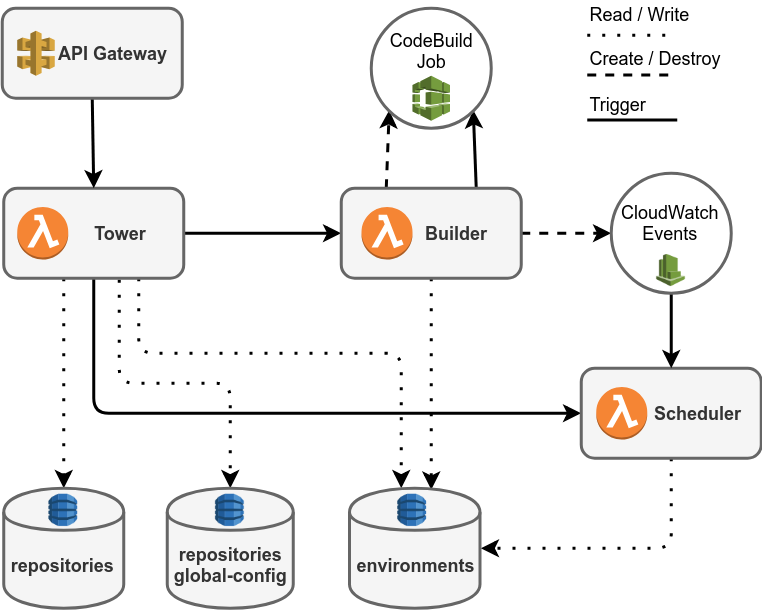

# Auto Staging Infrastructure

## Requirements

- Terraform
- Configured AWS CLI
- Golang

## Setup Auto Staging

### 1. Checkout Lambda code repositories to $GOPATH/src/github.com/auto-staging

```bash
cd $GOPATH/src/github.com/auto-staging

git clone git@github.com:auto-staging/scheduler.git
git clone git@github.com:auto-staging/builder.git
git clone git@github.com:auto-staging/tower.git
```

### 2. Adapt the variables in the vars.tfvars file

### 3. Create Symlinks for Lambda go

```bash
make symlinks
```

:warning: **You have to deploy the different Auto Staging modules in the order listed below.**

### 4. Deploy Tower-Lambda

```bash
cd tower
make deploy
```

### 5. Deploy Builder-Lambda

```bash
cd builder
make deploy
```

### 6. Deploy Scheduler-Lambda

```bash
cd scheduler
make deploy
```

## Auto Staging infrastructure overview



The Terraform files in the tower subdirectory create the following resources:

- API Gateway
- Tower Lambda function
- "repositories", "repositories global-config" and "environments" DynamoDB Tables

The Terraform files in the builder subdirectory create the following resources:

- Builder Lambda function

The Terraform files in the scheduler subdirectory create the following resources:

- Scheduler Lambda function

CodeBuild Jobs and CloudWatchEvents rules are created dynamicly at runtime by the Builder.

## License and Author

Author: Jan Ritter

License: MIT